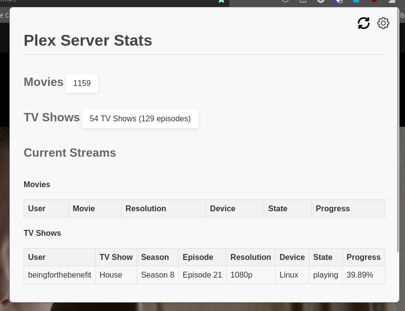

# Plex Server Stats Firefox Extension

## Description
The Plex Server Stats Firefox Extension provides a convenient way to monitor the status of your Plex Media Server right from your Firefox browser toolbar. It displays real-time information about the current streams, activities, and library statistics.

## Installation
You can install the Plex Server Stats Firefox Extension from the [Mozilla add-on collection](https://addons.mozilla.org/en-US/firefox/addon/plex-server-stats/). Simply visit the add-on page and click on the "Add to Firefox" button.

## Features
- Display real-time information about current streams, activities, and library statistics.
- Convenient access to Plex server status without leaving your browser.
- Easily customizable options to select movies and TV shows libraries.
- Quick links to jump to Plex server settings.

## Usage
After installing the extension, you'll see a new icon in your Firefox toolbar resembling a server. Click on the icon to open the popup window, which will display the current streams, activities, and library statistics.

To customize the extension, click on the cog icon in the upper-right corner of the popup. This will take you to the settings page where you can select your preferred movies and TV shows libraries.

## Feedback and Support
If you encounter any issues or have suggestions for improvement, please feel free to open an issue on the [GitHub repository](https://github.com/your-username/plex-server-stats).

## Contributions
Contributions are welcome! If you'd like to contribute to the project, please follow the guidelines outlined in the [CONTRIBUTING.md](./CONTRIBUTING.md) file.

## License
This project is licensed under the [MIT License](./LICENSE).

## Acknowledgements
Special thanks to the Mozilla team for including this extension in the Mozilla add-on collection.

## Screenshots

